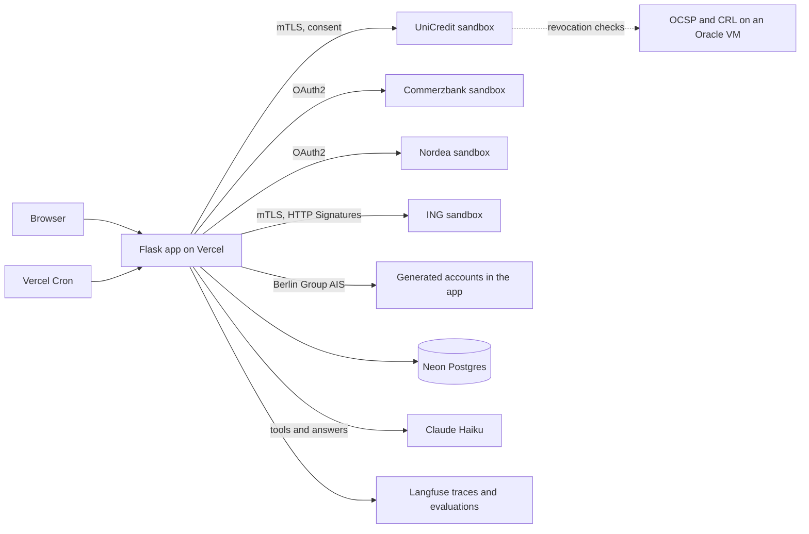

# FintNet

An Open Banking account information app. It connects to the PSD2 developer sandboxes of 4 European banks, shows every account in one place, and answers money questions across banks with Claude Haiku while code computes every figure.

**Live demo: https://bank-connectivity.vercel.app**

> **Test data only.** UniCredit, Commerzbank, Nordea and ING connect to each bank's public PSD2 developer sandbox with test users. The demo logins also hold generated accounts at those banks, tagged as generated in the app. No real customer data is used anywhere.

---

## Contents

- [What the app does](#what-the-app-does)
- [Banks and test logins](#banks-and-test-logins)
- [How the AI is used](#how-the-ai-is-used)
- [Evaluations](#evaluations)
- [Architecture](#architecture)
- [Run it locally](#run-it-locally)
- [Deploy on Vercel](#deploy-on-vercel)
- [Generated accounts](#generated-accounts)
- [Bank integration notes](#bank-integration-notes)
- [UniCredit trust chain: self-hosted OCSP and CRL](#unicredit-trust-chain-self-hosted-ocsp-and-crl)
- [Logging and tracing](#logging-and-tracing)
- [Project layout](#project-layout)
- [Roadmap](#roadmap)

---

## What the app does

| Page | Shows |
|---|---|
| **Connect** | One card per bank, consent status, connect and disconnect, and alerts on recurring spend (price rises, overlapping subscriptions, fixed charges as a share of income) |
| **Dashboard** | Spending, income and net cash flow for a date range with the change on the previous period, spending by category and by bank, 6 months of expenses, top merchants, recent transactions |
| **Balances** | Every account across every bank, with SEK and other currencies converted to EUR at ECB rates |
| **Spending** | Categories with a per-bank split and the change on the previous period |
| **Recurring** | Fixed and variable recurring payments and recurring income, detected from 2 or more months of history |
| **Ask** | Questions about money across all connected banks, answered by Claude Haiku from deterministic tools |
| **Ops** | Daily job runs, categoriser accuracy by day, certificate and revocation health, model usage, recent events |

The app is multi-tenant: each login sees only its own connections and data. Disconnecting revokes the connection and keeps the history.

---

## Banks and test logins

All logins use the password **`TestPass123`**. The login page lists them as chips that fill in the form. Each login is the test user in one bank's live sandbox (its home bank), and also holds generated accounts at one or more of the 4 banks, so questions across banks have 13 months of data to answer from.

| Login | Live sandbox (home bank) | Generated accounts |
|---|---|---|
| `mario.rossi@example.it` | UniCredit (IT), account `IT18L0200811770000019486580` | UniCredit current and savings, Commerzbank card account |
| `thomas.mann@example.de` | Commerzbank (DE), 2 EUR accounts | Commerzbank current and savings, ING card account |
| `aino.salo@example.fi` | Nordea (FI), 3 EUR accounts | Nordea current and savings, UniCredit everyday account |
| `margit.alros@example.se` | Nordea (SE), SEK and EUR accounts | Nordea current account (SEK), ING savings, Commerzbank card account, UniCredit everyday account |
| `a.vandijk@example.nl` | ING (NL), profile "Hr A van Dijk, Mw B Mol-van Dijk" | ING current and savings, Commerzbank card account |

Every login sees all 4 banks and picks which to connect:

| Connecting | What happens |
|---|---|
| The home bank | The bank's live sandbox flow, then the login's generated accounts at that bank are added too |
| Another bank where the login holds generated accounts | A sign-in and consent screen in that bank's colours lists the generated accounts |
| A bank where the login holds no account | The sign-in fails and nothing is connected |

Live sandbox consent steps:

| Bank | Consent step in the sandbox |
|---|---|
| UniCredit | Sign in as `ituser2bgk` / `pwituser2bgk` (UniCredit developer portal, Test Data page), grant the consent, press Proceed |
| Commerzbank | PSU-ID `DE80480800200405423400`; the sandbox consent is pre-approved |
| Nordea | No bank login: the sandbox approves the consent. Choose FI or SE |
| ING | Pick the profile on ING's page, then paste the code at `/ing/enter-code` |

Accounts created through sign-up hold no generated accounts and use the live sandbox flow at every bank.

---

## How the AI is used

The model is Claude Haiku 4.5 (`claude-haiku-4-5`). `llm.py` is the only module that calls it, with a per-instance call cap (`LLM_MAX_CALLS`), typed errors and a Langfuse trace for every call.

### Money questions (`/ask`)

`assistant.py` gives the model 7 deterministic tools:

| Tool | Returns |
|---|---|
| `list_accounts` | Accounts with bank, currency, native and EUR balance, first and last transaction date |
| `spending_by_category` | Spending per category for a period in EUR, optionally for one bank |
| `top_merchants` | Merchants paid most in a period, optionally within one category |
| `monthly_cash_flow` | Income, spending and net per month for up to 13 months, in EUR |
| `compare_periods` | Spending per category in 2 periods, with the difference and percentage change |
| `recurring_payments` | Fixed and variable recurring payments, recurring income and the spend alerts |
| `find_transactions` | Individual transactions matching filters, newest first, at most 25 |

The model picks tools for at most 6 rounds, and code computes every number it quotes. The page shows the tool trail under each answer and discloses that the answer comes from an AI system.

**Guardrails**
- Credit, loan, creditworthiness and investment questions are refused in code before any model call. The answer says it came from code and no model ran.
- IBANs are masked before traces reach Langfuse.

### Transaction categorisation

`categorize.py` sorts every transaction into 14 categories through a waterfall, cheapest layer first:

1. **Overrides.** A short hand-kept list for merchants a model gets wrong (for example "Infosys" is salary income).
2. **Cache.** `MerchantCategory`, keyed on the normalised merchant name. Each merchant goes to the model once.
3. **Model.** Claude Haiku returns a category, a confidence from 0 to 100 and a one-line reason. A local Ollama model is available with `CATEGORIZER_PROVIDER=ollama`.
4. **Rules.** A keyword fallback. Rule answers are provisional: they are never cached, and the daily categorise job upgrades them with the model.

Bank syncs never wait on the model. They run layers 1, 2 and 4, then the categorise job sends new merchants to the model in capped batches.

---

## Evaluations

Evaluations are written to Langfuse as datasets and experiment runs.

| Dataset | Built by | Graded on |
|---|---|---|
| `fintnet-categorisation-daily/<date>` | `/cron/evaluate`, every day | Model accuracy overall, on new merchants and on hard cases, confidence calibration, against the keyword rules |
| `fintnet-categorisation-benchmark` | `python evals/categoriser_experiment.py sync-benchmark` | The same, on a fixed 300-item sample for comparing prompts and models |
| `fintnet-assistant-questions` | `python evals/assistant_experiment.py sync` | Tool choice and the key figure in the answer (graded by code), plus a Groq `openai/gpt-oss-120b` judge on faithfulness, scope and concision |

**First daily run (14 Sep 2026), 150 synthetic transactions in a stratified sample:**

| Slice | Model | Keyword rules |
|---|---|---|
| Overall | 95.3% | 72.0% |
| New merchants | 100% | 33.3% |
| Hard cases (prefixes, truncation, typos) | 87.5% | 43.8% |

These figures come from one day of synthetic data. They show the categoriser working on the synthetic bank and make no claim about production bank data.

Run an experiment: `python evals/assistant_experiment.py run` or `python evals/categoriser_experiment.py run-benchmark`. Results are also saved to `evals/results/`, which git ignores.

---

## Architecture



- **Web app:** Flask with Flask-Login and SQLAlchemy. `api/index.py` is the Vercel entry point.
- **Storage:** Neon Postgres on Vercel, SQLite (`ais.db`) locally. `BankConnection` holds each user's tokens and consents, so connections survive across function instances.
- **Currency:** live ECB rates from `frankfurter.app`, cached for 1 hour, with a hardcoded fallback. Totals convert to EUR; single transactions show their own currency.
- **Bank clients:** one module per bank (`psd2_client.py` for UniCredit, `commerzbank_client.py`, `nordea_client.py`, `ing_client.py`, `synthbank_client.py`). `app._fetch_and_store` syncs accounts and transactions after every connect.

---

## Run it locally

```bash
python3 -m venv .venv
.venv/bin/pip install -r requirements.txt
.venv/bin/python app.py
```

Open https://localhost:5000 and accept the browser warning (the dev server uses a self-signed certificate, and UniCredit requires an HTTPS redirect URI).

An empty database seeds the 5 demo logins on startup. To add the evaluation population:

```bash
.venv/bin/python seed_data.py                  # 5 demo logins plus 200 evaluation customers, 13 months each
.venv/bin/python seed_data.py --population 0   # demo logins only
```

Seeding is re-runnable: it only creates missing users, customers and history.

**`.env` for local runs** (never committed):

| Variable | For |
|---|---|
| `FLASK_SECRET_KEY` | Sessions and generated-account consent tokens |
| `ANTHROPIC_API_KEY`, `LLM_MODEL=claude-haiku-4-5` | Assistant and categoriser. Without a key, the categoriser falls back to Ollama or rules |
| `CB_CLIENT_ID`, `CB_CLIENT_SECRET` | Commerzbank sandbox |
| `NORDEA_CLIENT_ID`, `NORDEA_CLIENT_SECRET`, `NORDEA_COUNTRY` | Nordea sandbox |
| `ING_CLIENT_ID`, `ING_COUNTRY_CODE`, `ING_TLS_CERT_PATH`, `ING_TLS_KEY_PATH`, `ING_SIGNING_CERT_PATH`, `ING_SIGNING_KEY_PATH` | ING sandbox |
| `CERT_PATH`, `KEY_PATH`, `SANDBOX_BASE_URL`, `UC_X_COUNTRY`, `UC_X_LEGAL_ENTITY` | UniCredit sandbox |
| `LANGFUSE_PUBLIC_KEY`, `LANGFUSE_SECRET_KEY`, `LANGFUSE_BASE_URL` | Tracing and evaluations (optional) |
| `GROQ_API_KEY` | Assistant evaluation judge (optional) |

---

## Deploy on Vercel

`vercel.json` routes every request to `api/index.py` and schedules 4 daily jobs.

| Concern | How it works |
|---|---|
| Certificates | Leaf certificates and keys are sensitive env vars (`UC_CERT_B64`, `UC_KEY_B64`, `ING_TLS_CERT_B64`, `ING_TLS_KEY_B64`, `ING_SIGNING_CERT_B64`, `ING_SIGNING_KEY_B64`). `runtime_certs.py` decodes them to `/tmp` with mode 0600 on cold start. Root, intermediate and OCSP-signer keys never leave the developer's laptop. |
| Database | Neon Postgres from the Vercel Marketplace (`DATABASE_URL`) |
| Sessions | `FLASK_SECRET_KEY` is required; the app refuses to start on Vercel without it |
| UniCredit redirect | `REDIRECT_URI=auto` builds `https://<current host>/callback`, so the flow works on any domain attached to the project |
| Model | `ANTHROPIC_API_KEY`, `LLM_MODEL=claude-haiku-4-5`, `LLM_MAX_CALLS`, `CATEGORISE_LIMIT`, `EVAL_SAMPLE`, `SYNC_CATEGORISE_LIMIT` |
| Event log | Upstash Redis (`KV_REST_API_URL`, `KV_REST_API_TOKEN`); without it, events go to the Vercel runtime log |
| `.vercelignore` | Keeps `.env`, `certs/`, local databases, spikes and certificate tooling out of the bundle |

### Daily jobs

| UTC | Route | Does |
|---|---|---|
| 01:00 | `/cron/feed` | Books missing days of generated transactions (up to 7 per run), drops history older than 13 months, re-syncs connected users |
| 02:00 | `/cron/categorise` | Sends merchants with a provisional rule category to Claude Haiku, capped per run |
| 03:00 | `/cron/evaluate` | Builds the day's Langfuse dataset and runs one experiment on it |
| 04:00 | `/cron/health` | CRL next update, OCSP status of the UniCredit certificate, certificate expiry |

Vercel Hobby runs each job once a day, somewhere within the scheduled hour. Every route requires `Authorization: Bearer $CRON_SECRET`, runs once per date (the `job_runs` table; add `?force=1` to rerun) and reports on the Ops page.

```bash
curl -H "Authorization: Bearer $CRON_SECRET" https://bank-connectivity.vercel.app/cron/status
```

---

## Generated accounts

The live sandboxes return a handful of static transactions, which is too little history for an assistant or an evaluation. `synthbank/` generates accounts and transactions and serves them through a Berlin Group NextGenPSD2 AIS API inside the app.

- **Customers:** the 5 demo logins, plus an evaluation population (200 by default) across DE, FI, SE (in SEK), NL and IT that no login can see.
- **Accounts at real bank names:** each demo login holds generated accounts at the banks listed in `synthbank/catalog.py` (`DEMO_CUSTOMERS`), each with a role. The main account books salary, rent and bills; the savings account gets the monthly savings transfer; a card account books subscriptions, gym and shopping; an everyday account books dining, transport and half the groceries. The main account tops up card and everyday accounts at other banks on the 2nd of each month. In the app, generated accounts are stored under the bank's name so they add up with its live sandbox accounts, and are tagged as generated.
- **History:** a rolling 13 months, seeded once and then extended one day at a time by the feed job. Random generators are seeded by customer and date, so reruns reproduce the same data.
- **Realistic merchants:** each purchase draws a category weighted by persona, then a merchant that belongs to it: about 60% known merchants, 30% new merchants built from templates and 10% hard cases (payment-facilitator prefixes, truncation, typos, misleading names). No language model writes the data.
- **Subscriptions and price rises:** about a third of customers get a 15% price rise on one subscription partway through the year, so the price-rise alert has something real to find.
- **Label firewall:** the true category of every transaction lives in `sb_labels`, which only the evaluation job reads. The API, the tools and the model never see it.
- **API:** `POST /synthetic-bank/v1/consents?bank=<bank>`, `GET /synthetic-bank/v1/accounts`, `.../balances` and `.../transactions` with a `Consent-ID` header, and a sign-in and consent screen at `/synthetic-bank/authorise/<consent>`. A consent covers one customer's accounts at one bank.
- **Rebuild:** `python seed_data.py --population 0 --reset-demo` regenerates the demo logins' accounts and removes their FintNet accounts and connections.

---

## Bank integration notes

### UniCredit

- **mTLS with a QWAC** on every call, and a Berlin Group consent that the user approves on UniCredit's own page.
- **F5 BIG-IP gateway.** The sandbox is behind an F5 access gateway. A request without the gateway's session cookie is redirected to `/my.policy`, an HTML page a browser submits by itself. `psd2_client.py` keeps one cookie session per process and retries when that page comes back. Before this, most consent requests from Vercel failed.
- **Owner name.** The account list leaves out `ownerName`; the sync reads it from the account-details call.
- **`PSU-IP-Address`** gets a random public-range address on each request, since the hosted demo has no customer IP to forward.

### ING

- Two **separate key pairs**: one for mTLS, one for HTTP Request Signatures.
- Two **`keyId` formats**: the app token call uses `keyId="SN=<certificate serial in hex>"` with the signature in `Authorization` and a `TPP-Signature-Certificate` header; every bearer-token call uses `keyId="<client_id>"` with the signature in `Signature`.
- The sandbox example client redirects to `https://www.example.com/`. After authorising, copy the `code` from the address bar into `/ing/enter-code`.
- Transactions are requested for **89 days**. ING answers 403 for anything older than 90 days, because PSD2 requires fresh strong customer authentication for older history.
- In the sandbox, the account of "Mw B Mol" and the credit card return server errors from ING. The sync skips them and still saves the connection.

### Nordea

- The sandbox mock authorizer returns the authorization code in the `Location` header, so the registered redirect URI is only echoed and never visited.
- Country (FI, SE, DK or NO) is chosen on the consent page. The owner name comes from `account_name`, because the sandbox leaves `name` empty.

### Commerzbank

- OAuth2 client credentials, then a pre-approved sandbox consent. No redirect.

---

## UniCredit trust chain: self-hosted OCSP and CRL

UniCredit's gateway is strict about certificate revocation:
- It fails the TLS handshake if the OCSP host in the certificate cannot be reached.
- It only follows `http://` revocation URLs, because the F5 TLS profile will not validate a certificate chain in order to fetch the list that validates it.

So the leaf certificate points at OCSP and CRL endpoints this project runs over plain HTTP:

- `generate_psd2_cert.py` issues the QWAC chain (root, intermediate, leaf) with ETSI PSD2 `qcStatements` (PSP_AI role, BaFin authority, `PSDDE-BAFIN-19337`). The leaf points at:
  - `http://ocsp.fintnet.ai`: OCSP responder
  - `http://crl.fintnet.ai/crl.crl`: CRL distribution point
  - `http://crl.fintnet.ai/inter.crt`: issuer certificate for path building
- `generate_ocsp_signer.py` issues a delegated OCSP signer (`id-kp-OCSPSigning` with `id-pkix-ocsp-nocheck`), so the intermediate's key stays on the laptop and the server only holds the signer's key.
- Both endpoints run on one Always Free Oracle Cloud VM: `openssl ocsp` as the signing backend behind a small standard-library Python proxy on port 80 that serves the CRL and issuer certificate. Both run as systemd services.
- `refresh_crl.py` re-signs the CRL (valid for 30 days) and `deploy_crl.sh` copies it to the VM. Run both monthly.

The bank imports `chain.crt` once; later leaf certificates under the same intermediate need no new trust. Vercel cannot serve these endpoints because it forces HTTPS. The `/cron/health` job and the Ops page check the CRL, OCSP and certificate expiry every day.

---

## Logging and tracing

| Layer | Where | Contains |
|---|---|---|
| Application log | `logs/fintnet.json` locally (rotated at 10 MB, 5 backups), the Vercel runtime log in production | One JSON object per line: `auth.*`, `connection.upsert`, `connection.disconnect`, `sync.complete` with `latency_ms`, `sync.account.skipped`, `sync.owner_name.skipped`, `categorize.model.failed`, `currency.fetch_failed`, `cron.failed`, `unicredit.gateway_session` |
| Event log | `eventlog.py`: `logs/events.jsonl` locally, Upstash Redis on Vercel | Every assistant request, tool call, model call, job run and score, in Splunk HTTP Event Collector format. Set `SPLUNK_HEC_URL` and `SPLUNK_HEC_TOKEN` to send the same lines to Splunk |
| Traces | Langfuse (`observability.py`) | Model generations with tokens, tool spans, scores, datasets and experiment runs, with IBANs masked |

---

## Project layout

| Path | Purpose |
|---|---|
| `app.py` | Routes, analytics, recurring payment and spend alert detection, sync |
| `api/index.py` | Vercel entry point |
| `models.py`, `db_utils.py` | Tables and per-user upserts, with duplicate protection on transaction id |
| `auth.py` | UniCredit consent flow helpers |
| `psd2_client.py`, `commerzbank_client.py`, `nordea_client.py`, `ing_client.py` | Live sandbox clients |
| `synthbank/`, `synthbank_client.py` | Generated accounts: catalogue, generator, store, API, client |
| `llm.py` | The only Claude call site: model, call cap, errors, tracing |
| `assistant.py` | `/ask` tools, tool loop and refusal |
| `categorize.py` | Categorisation waterfall and provisional upgrades |
| `evaluate.py`, `evals/` | Daily categoriser evaluation, benchmark and assistant experiments, judge |
| `cron.py` | Daily job routes |
| `health.py` | CRL, OCSP and certificate checks |
| `observability.py`, `eventlog.py`, `logging_config.py` | Langfuse, event log, application log |
| `currency_utils.py` | ECB exchange rates |
| `runtime_certs.py` | Certificates from env vars on Vercel |
| `seed_data.py` | Demo logins, generated customers, `--reset-demo` |
| `generate_psd2_cert.py`, `generate_ocsp_signer.py`, `refresh_crl.py`, `deploy_crl.sh` | Certificate and revocation tooling (local only) |
| `templates/` | Jinja pages |

**Earlier local-model experiments.** Before the hosted build, categorisation ran fully offline on Ollama with Qwen 2.5 3B. These scripts remain for reference and need a local Ollama: `agent.py` (a hand-written tool loop over the transactions database), `eval_categorizer.py` (rules against the local model), `backfill_categories.py`, `genai_json_demo.py` and `genai_test.py`.

---

## Roadmap

- **More banks** through one Berlin Group NextGenPSD2 adapter driven by a bank registry (Santander, BNP Paribas, BBVA), keeping bespoke clients only for banks that differ from the standard.
- **Consent lifecycle:** token refresh, expiry detection with a reconnect prompt, and renewal before the 180-day window ends.
- **MCP server** exposing accounts, transactions and recurring payments as tools for Claude Desktop and Claude Code.
- **Separate Langfuse project** for FintNet traces and evaluations.

---

## License

MIT. See [LICENSE](LICENSE).
